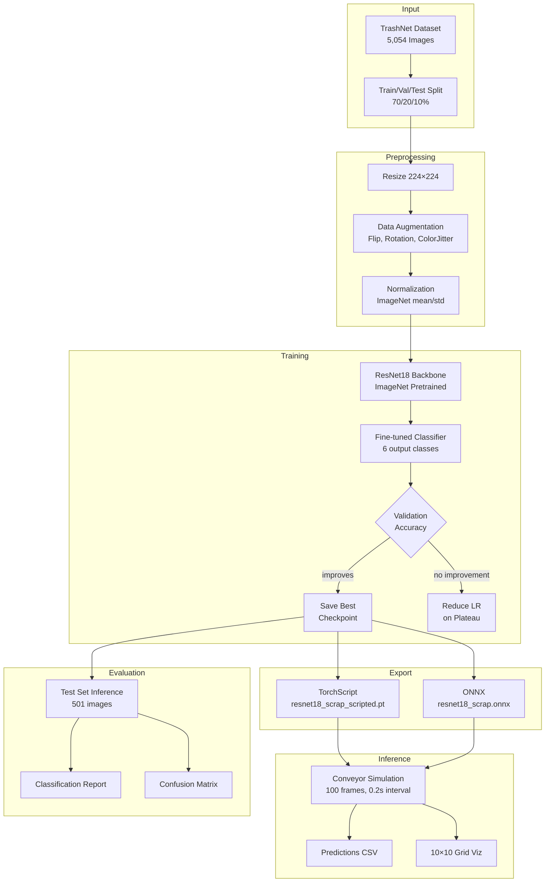
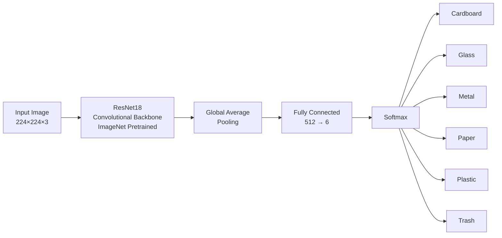
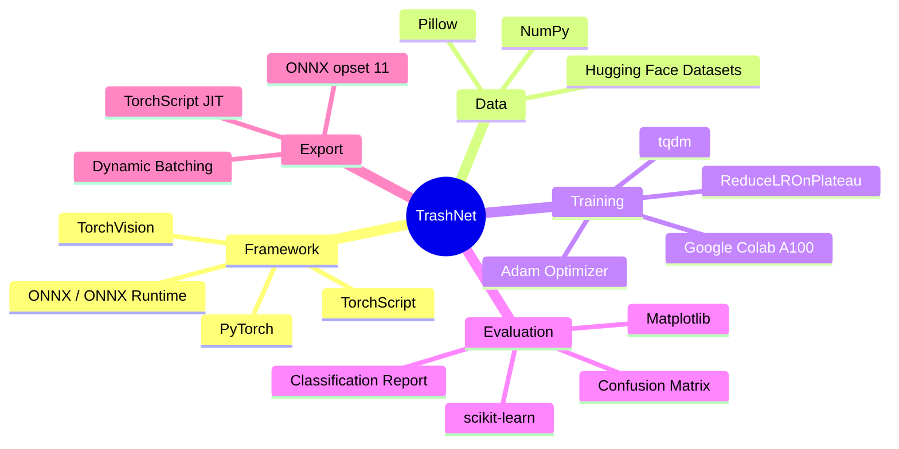
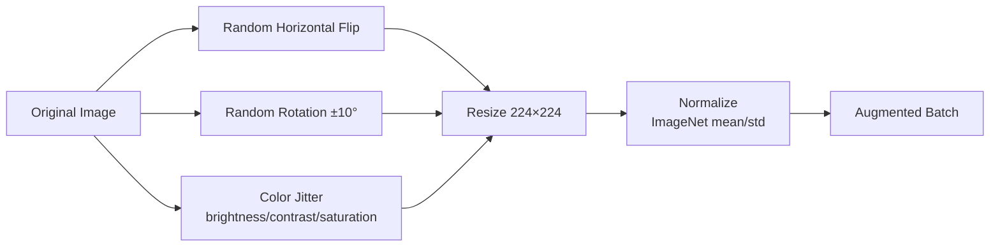
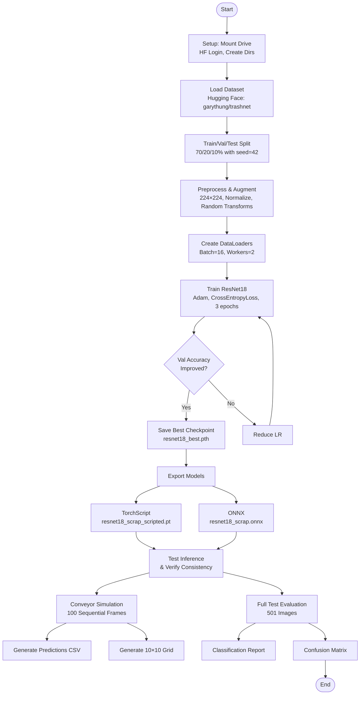
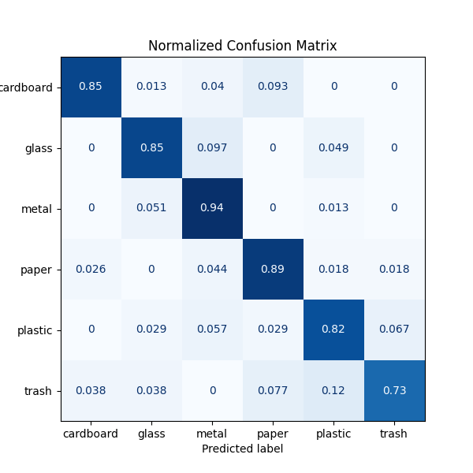
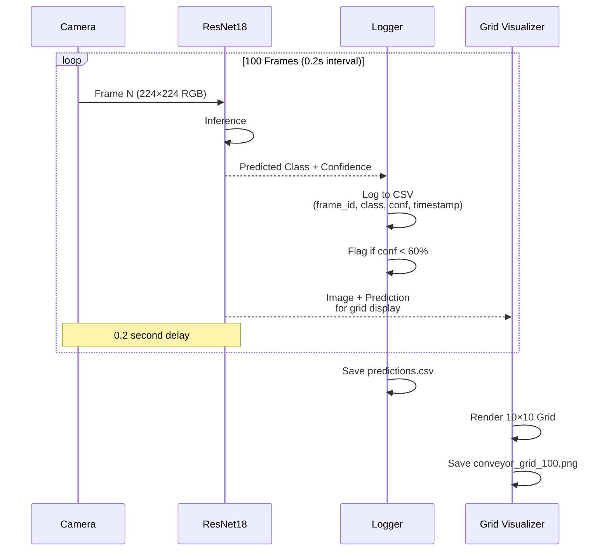
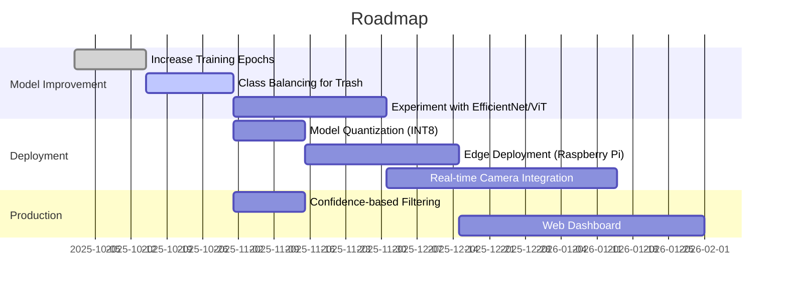

<div align="center">

# TrashNet — Automated Waste Classification

**v1.0.0** — *A deep learning-based waste sorting system using ResNet18, built for smart recycling automation*

[](https://python.org)
[](https://pytorch.org)
[](https://onnx.ai)
[](https://scikit-learn.org)
[](https://huggingface.co/datasets/garythung/trashnet)
[](LICENSE)
[](performace/performance_report)

**Created by [Kumar Satyam](mailto:kumarsatyam3135@gmail.com)**

Classifies waste into **6 categories** — cardboard, glass, metal, paper, plastic, trash — achieving **86.23% test accuracy** with a ResNet18 model fine-tuned via transfer learning. Includes a simulated real-time conveyor belt sorting pipeline, TorchScript/ONNX model export, and comprehensive evaluation.

</div>

---

## Table of Contents

- [Overview](#overview)
- [Architecture](#architecture)
- [Tech Stack](#tech-stack)
- [Dataset](#dataset)
- [Pipeline](#pipeline)
- [Model Performance](#model-performance)
- [Conveyor Simulation](#conveyor-simulation)
- [Model Export](#model-export)
- [Getting Started](#getting-started)
- [Repository Structure](#repository-structure)
- [Results](#results)
- [Future Work](#future-work)
- [License](#license)

---

## Overview



---

## Architecture

### Model: ResNet18 with Transfer Learning



| Component | Detail |
|-----------|--------|
| **Backbone** | ResNet18 pre-trained on ImageNet |
| **Modification** | Final FC layer replaced: `512 → 6` |
| **Input Size** | 224×224 pixels, RGB |
| **Loss** | CrossEntropyLoss |
| **Optimizer** | Adam (lr = 1×10⁻⁴) |
| **Scheduler** | ReduceLROnPlateau (factor=0.5, patience=2) |
| **Epochs** | 3 |
| **Batch Size** | 16 |

---

## Tech Stack



| Technology | Purpose |
|------------|---------|
| **PyTorch** | Deep learning framework for model building and training |
| **TorchVision** | Pre-trained ResNet18 models and image transforms |
| **Hugging Face Datasets** | Dataset loading (`garythung/trashnet`) |
| **ONNX / ONNX Runtime** | Cross-platform model export and inference |
| **scikit-learn** | Classification metrics and confusion matrix |
| **Matplotlib** | Visualization (confusion matrix, conveyor grid) |
| **Google Colab** | GPU-accelerated training (NVIDIA A100) |

---

## Dataset

The **TrashNet** dataset ([garythung/trashnet](https://huggingface.co/datasets/garythung/trashnet)) contains **5,054** images of waste items across six classes:

| Class      | Description | Train | Val | Test |
|------------|-------------|-------|-----|------|
| Cardboard  | Corrugated cardboard / paperboard | ~525 | ~150 | 75 |
| Glass      | Bottles, jars, glass items | ~721 | ~206 | 103 |
| Metal      | Cans, aluminum, metal objects | ~546 | ~156 | 78 |
| Paper      | Paper, newspaper, magazines | ~798 | ~228 | 114 |
| Plastic    | Plastic bottles, containers, bags | ~735 | ~210 | 105 |
| Trash      | Miscellaneous non-recyclable waste | ~182 | ~52 | 26 |
| **Total**  | | **3,537** | **1,016** | **501** |

### Data Augmentation (Training Only)



- `RandomHorizontalFlip` — mirror images with 50% probability
- `RandomRotation(10)` — small rotational variations
- `ColorJitter(0.2, 0.2, 0.2, 0.05)` — brightness, contrast, saturation shifts

---

## Pipeline

### Full Training & Evaluation Pipeline



---

## Model Performance

### Overall Metrics

| Metric | Score |
|--------|-------|
| **Accuracy** | **86.23%** |
| Precision (macro avg) | 84.35% |
| Recall (macro avg) | 84.80% |
| F1-score (macro avg) | 84.32% |

### Per-Class Performance

| Class      | Precision | Recall | F1-Score | Support |
|------------|-----------|--------|----------|---------|
| Cardboard  | 0.9412    | 0.8533 | 0.8951   | 75      |
| Glass      | 0.9072    | 0.8544 | 0.8800   | 103     |
| Metal      | 0.7526    | 0.9359 | 0.8343   | 78      |
| Paper      | 0.8947    | 0.8947 | 0.8947   | 114     |
| Plastic    | 0.8866    | 0.8190 | 0.8515   | 105     |
| Trash      | 0.6786    | 0.7308 | 0.7037   | 26      |

### Confusion Matrix



**Key Observations:**
- **Best performing**: Cardboard (94% precision), Metal (94% recall)
- **Worst performing**: Trash class — only 26 test samples, visually diverse, often confused with plastic and paper
- ~8% of predictions fell below the 60% confidence threshold

---

## Conveyor Simulation

A real-time waste-sorting simulation that processes 100 test images sequentially (0.2s per frame), mimicking a smart recycling facility's conveyor belt camera feed.



### Sample Predictions

| Frame | Predicted | Confidence | Flag |
|-------|-----------|------------|------|
| 000   | trash     | 94.90%     | ✅   |
| 002   | glass     | 59.13%     | ⚠️ Low |
| 004   | paper     | 99.89%     | ✅   |
| 016   | cardboard | 99.88%     | ✅   |
| 087   | trash     | 58.56%     | ⚠️ Low |


### Configuration

| Parameter | Value |
|-----------|-------|
| Confidence threshold | 60% |
| Frame interval | 0.2–0.3 seconds |
| Max frames | 100 |
| Inference backend | TorchScript (default) / ONNX |

---

## Model Export

Models are exported for production deployment in two formats:

### TorchScript
```python
model = resnet18(weights=None)
model.fc = nn.Linear(model.fc.in_features, 6)
model.load_state_dict(checkpoint["model_state"])
scripted = torch.jit.trace(model, example_input)
scripted.save("resnet18_scrap_scripted.pt")
```

### ONNX
```python
torch.onnx.export(model, example_input, "resnet18_scrap.onnx",
    input_names=["input"], output_names=["output"],
    dynamic_axes={"input": {0: "batch_size"}, "output": {0: "batch_size"}},
    opset_version=11)
```

### Download Pre-trained Models

Model files are too large for GitHub. Download from Google Drive:

| Model | Format | Link |
|-------|--------|------|
| Best Checkpoint | `.pth` | [Download](https://drive.google.com/file/d/10JszPCeLGit6z2AhdHYiCopa_UErfrFH/view?usp=sharing) |
| TorchScript | `.pt` | [Download](https://drive.google.com/file/d/1yxiXjOR5bKCjUFg6Je_xaWrPj3rEsgYa/view?usp=sharing) |
| ONNX | `.onnx` | [Download](https://drive.google.com/file/d/1Oa7X3O249ja09acwTNWVQW8wQjy9E2Ne/view?usp=sharing) |

---

## Getting Started

### Prerequisites

```bash
pip install torch torchvision datasets huggingface_hub tqdm scikit-learn onnx onnxruntime pillow matplotlib numpy
```

### Run the Full Pipeline

```bash
# Clone the repo
git clone https://github.com/krsatyam36/trashNet-.git
cd trashNet-

# Run the complete training + evaluation script
python src/trash_net_script.py
```

> **Note**: The script was designed for Google Colab and includes Colab-specific commands (`drive.mount`, `!pip`, etc.). For local execution, comment out Colab-specific cells and adjust paths accordingly.

### Run Inference on a Single Image

```python
import torch
from torchvision import transforms
from PIL import Image

# Load TorchScript model
model = torch.jit.load("models/resnet18_scrap_scripted.pt").eval()

# Preprocess image
preprocess = transforms.Compose([
    transforms.Resize((224, 224)),
    transforms.ToTensor(),
    transforms.Normalize([0.485,0.456,0.406], [0.229,0.224,0.225])
])

# Predict
img = Image.open("your_image.jpg").convert("RGB")
x = preprocess(img).unsqueeze(0)
with torch.no_grad():
    probs = torch.nn.functional.softmax(model(x), dim=1)

classes = ['cardboard', 'glass', 'metal', 'paper', 'plastic', 'trash']
pred_idx = probs.argmax().item()
print(f"Predicted: {classes[pred_idx]} ({probs[0][pred_idx]:.2%})")
```

---

## Repository Structure

```
trashNet-/
├── README.md                          # Project documentation (this file)
├── LICENSE                            # MIT License
├── .gitignore
├── data/
│   ├── predictions.csv                # 100-frame conveyor simulation output
│   ├── confusion_matrix.png           # Normalized confusion matrix
│   ├── conveyor_grid_100.png          # 10×10 prediction grid visualization
│   └── output_csv/                    # Placeholder for additional CSVs
├── models/
│   └── model_info.txt                 # Google Drive links for model files
├── performace/
│   └── performance_report             # Detailed performance analysis report
└── src/
    ├── trash_net_script.py            # Complete Python pipeline script
    ├── trash_net_script_github.ipynb  # Full Jupyter notebook with outputs
    └── trash_net_script.ipynb         # Placeholder (refer to GitHub version)
```

---

## Results

### Visual Evaluation Grid


The 10×10 grid shows 100 test images with their predicted class and confidence score. Low-confidence predictions (<60%) are flagged.

### Performance Report

A detailed performance report covering model architecture, training setup, per-class metrics, confusion matrix analysis, and recommendations is available at [`performace/performance_report`](performace/performance_report).

---

## Future Work



- **Increase training epochs** — current 3-epoch model shows room for improvement
- **Class balancing** — the Trash class (only 26 test samples) needs more diverse data
- **Architecture exploration** — EfficientNet, MobileNet, or Vision Transformers for higher accuracy or edge deployment
- **Model quantization** — INT8 quantization for faster edge inference
- **Real-world lighting** — incorporate varied backgrounds and lighting conditions
- **Confidence-based filtering** — flag uncertain predictions during live sorting

---

## License

This project is licensed under the **MIT License** — see the [LICENSE](LICENSE) file for details.

Copyright (c) 2025 newton4th
